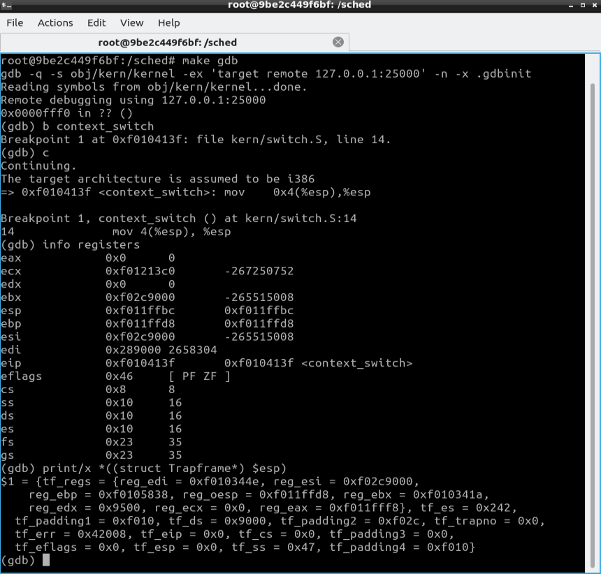
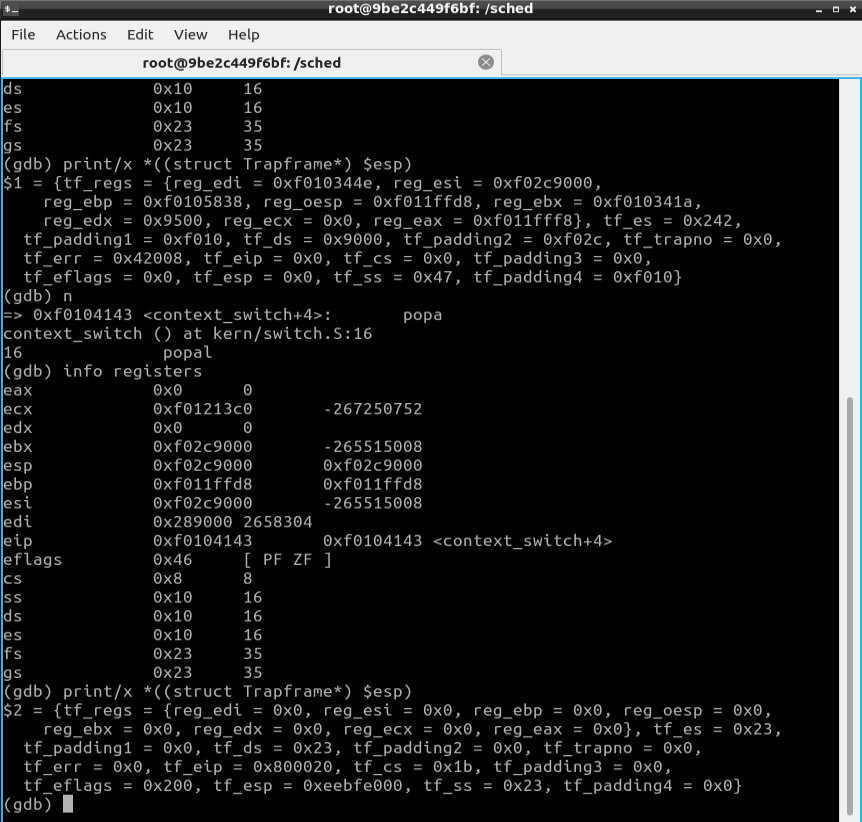
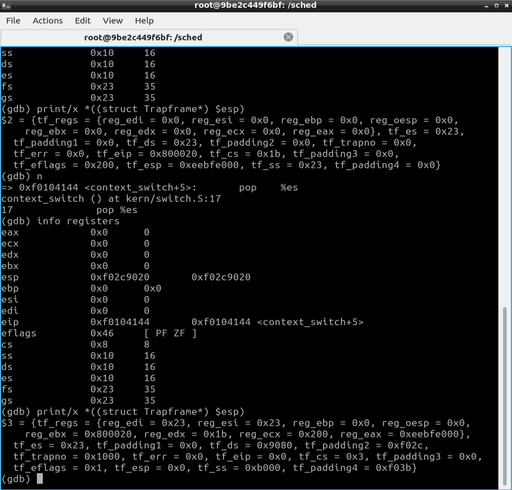
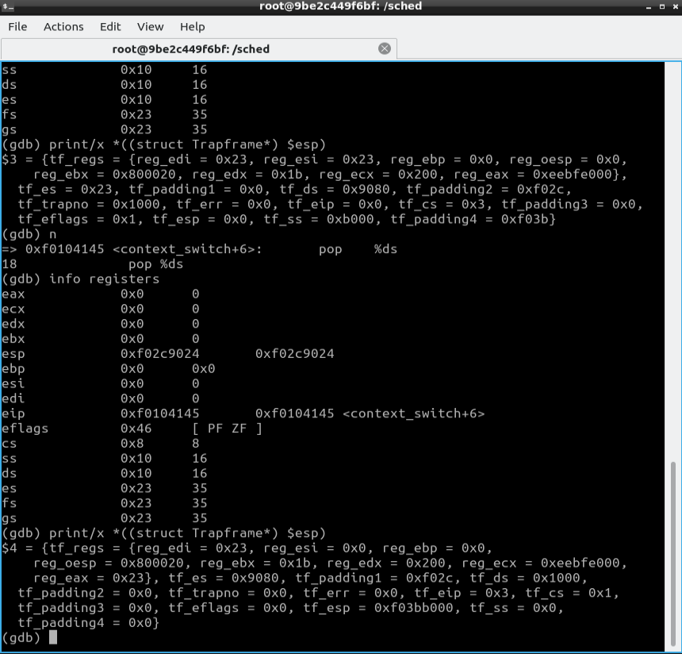
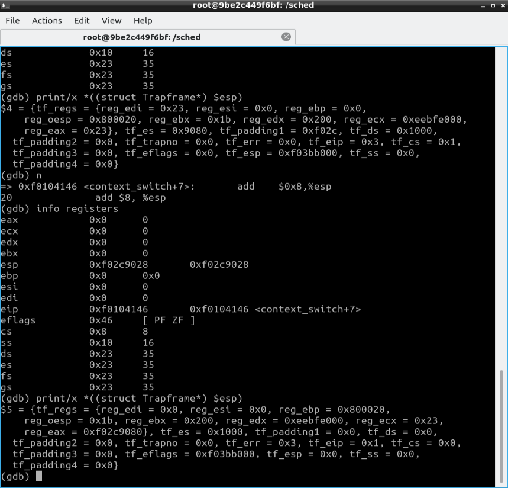
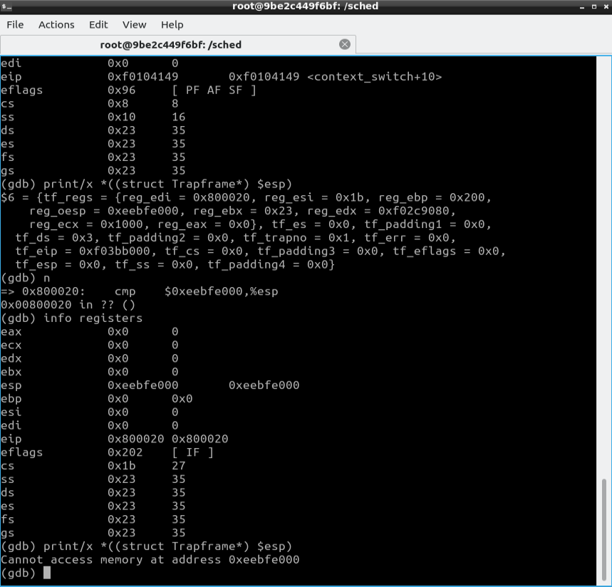

# TP: SCHED

Informe sobre nuestra implementacion del TP 2 de la materia Sistemas Operativos. Se explica el scheduler elegido por nosotros para implementar el scheduler con prioridades, y se agrega el seguimiento con GDB instruccion por instruccion del cambio de contexto de un env.

## Seguimiento de GDB

A continuacion, vamos a redactar una explicacion sobre la visualizacion del cambio de contexto de un environment, lo que permitira identificar el estado del stack al inicio de la llamada a context_switch, como cambia el stack instruccion a instruccion notando el cambio del valor del stack pointer, y como se modifican los registros luego de ejecutar la instruccion iret.

- Instruccion `mov 4(%esp), %esp`.
(!) Se visualiza el estado de los registros y el Trapframe al comienzo de la funcion context_switch.

- Instruccion `popal`.

- Instruccion `pop %es`.
Se visualiza el cambio en los registros luego de la instruccion popal.

- Instruccion `pop %ds`.

- Instruccion `add $8, %esp`.

- Instruccion `iret`.
(!) Se puede identificar el estado de los registros y el Trapframe antes de hacer el llamado a la instruccion iret.

- Siguiente instruccion del iret.
(!) Se pueden visualizar los registros luego de la ejecucion a iret.

---

## Scheduler con Prioridades: Lottery

Nosotros implementamos un algoritmo de planificacion de loteria, que es una forma de planificacion de procesos con prioridades.

La idea basica de la planificacion de loteria es que cada env recibe un numero de "tickets" proporcional a su prioridad. Luego, se selecciona un ticket al azar y el proceso que posee ese ticket se ejecuta. Todos los envs en nuestra implementacion tienen una cantidad inicial de 100 tickets. Cuando se ejecuta un env, se le resta un ticket hasta llegar a la minima cantidad de tickets que corresponde a 1.

Yendo paso por paso, primero se calcula la cantidad total de tickets entre todos los environments (dentro del array envs) que tienen como estado ENV_RUNNABLE.

Si la cantidad total de tickets es 0 despues de recorrer todos los procesos, eso significa que no hay ningun proceso listo para ejecutarse. En ese caso, corre el argumento actual.

Si no es ese el caso, entonces se genera un numero pseudoaleatorio (aplicandole la operacion modulo sobre la cantidad total de tickets) para definir el ticket ganador. De esta forma, se recorre entre todos los posibles envs ganadores para, al final, elegir el env a correr generando un nuevo numero pseudoaleatorio y definido por la cantidad de envs posibles a correr, y comienza a correr uno de ellos.

Para la generacion de numeros pseudoaleatorios, nosotros nos basamos en "Lehmer random number generator" que es un tipo de algoritmo "Linear congruential generator", que busca generar numeros pseudoaleatorios en base a la ejecucion de ecuaciones lineales discontinuas.

---

### Syscalls agregadas

- sys_env_get_priority(): Devuelve la prioridad de un proceso. Si el envid es 0, devuelve la prioridad del proceso actual. Devuelve la prioridad del proceso, o -1 en caso de error.
- sys_env_set_priority(): Disminuye la prioridad del proceso actual. Esto lo realiza disminuyendo la cantidad de tickets que posee. No se le permite a un proceso aumentar la prioridad, pero si reducirla. Devuelve 0 si se realizo correctamente, -1 en caso de error.
- sys_env_change_priority(): Aumenta la prioridad de un env, definido por su process_id. En caso de que el env no se este corriendo, y este listo para ser corrido, se le asigna la prioridad deseada incrementando el valor de la cantidad de tickets que posee. En caso de que el env se este corriendo, se le disminuye la prioridad recibida por parametro. Si el valor de la prioridad es menor a 1 o mayor a 100, se devuelve -1. Devuelve 0 si se realizo correctamente, -1 en caso de error o si no se encuentra el env.

### Archivos de tests de las syscalls

- `testpriorities.c`: Corre un unico env y verifica su prioridad (cantidad de tickets). Luego, intenta cambiarle la cantidad de tickets que posee. Comando: `make run-testpriorities-nox`
- `testpriorities2.c`: Corre dos envs e intentan cambiarse la prioridad de cada uno (a si mismo) verificando que el cambio se realice correctamente. Comando: `make run-testpriorities2-nox`
- `testpriorities3.c`: Corre dos envs e intentan cambiarse la prioridad entre si, donde un env le cambia la prioridad al otro mientras no se corre, y verificando que el cambio se realice correctamente. Comando: `make run-testpriorities3-nox`
- Flag para correr el archivo de test con el scheduler por prioridades: `USE_PR=1`
